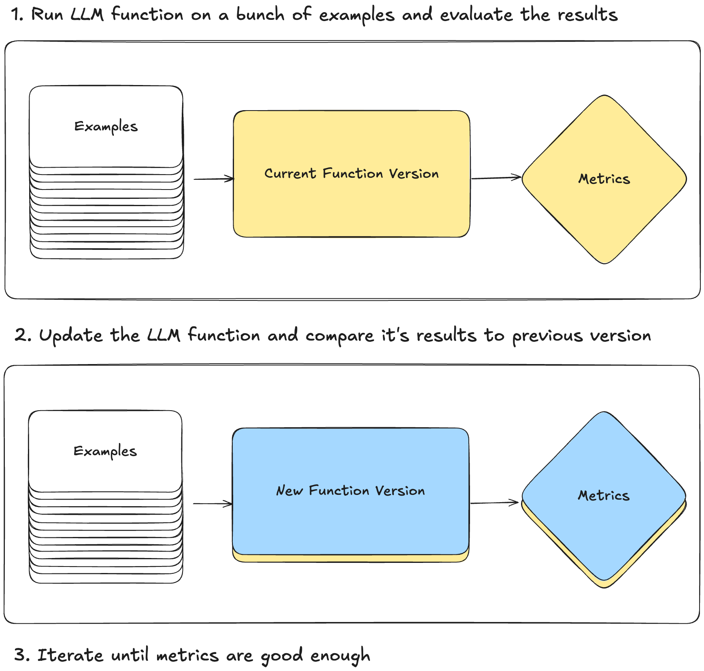
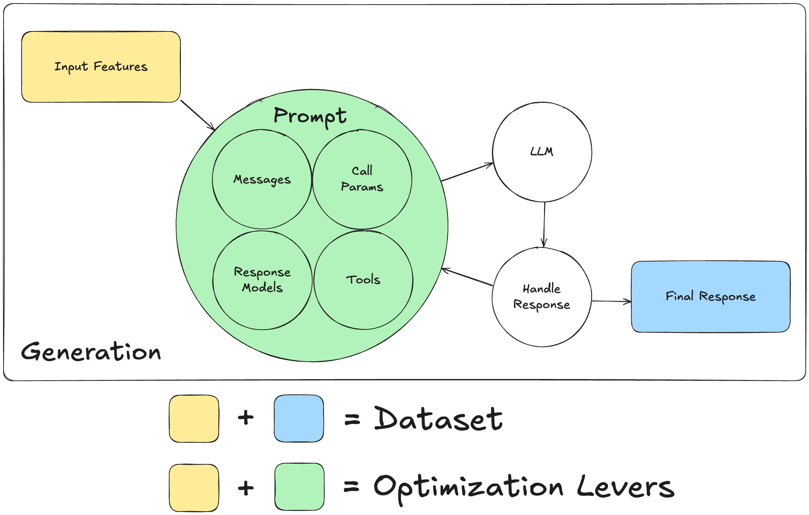
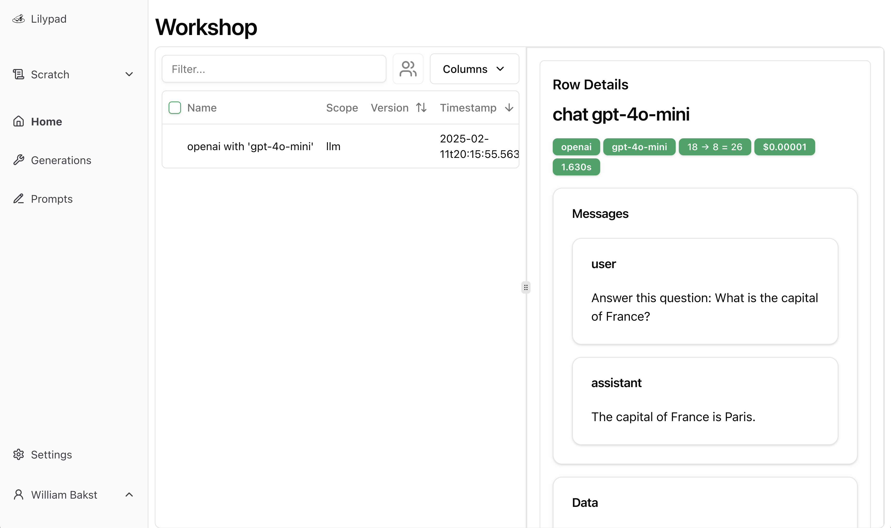
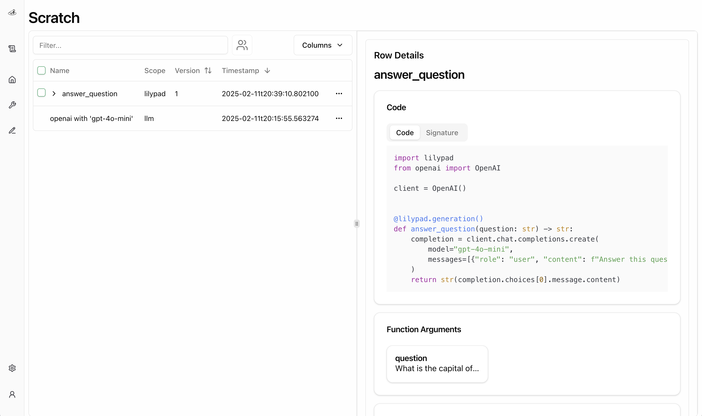
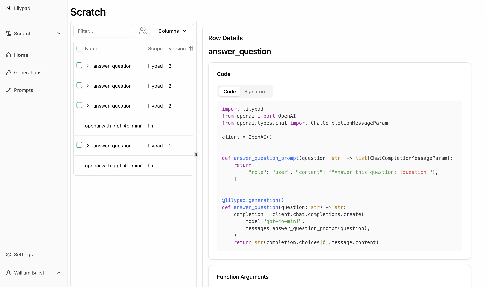
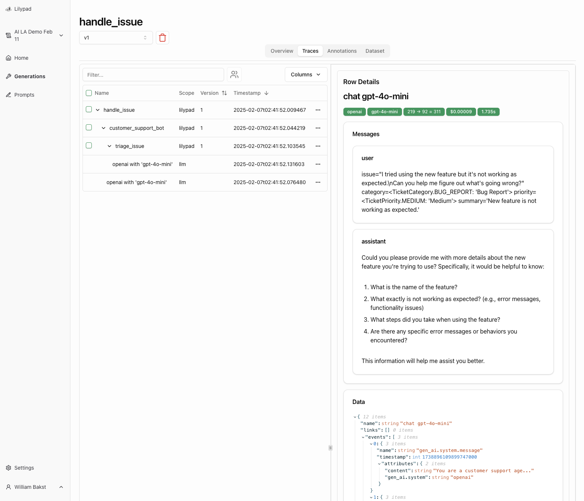
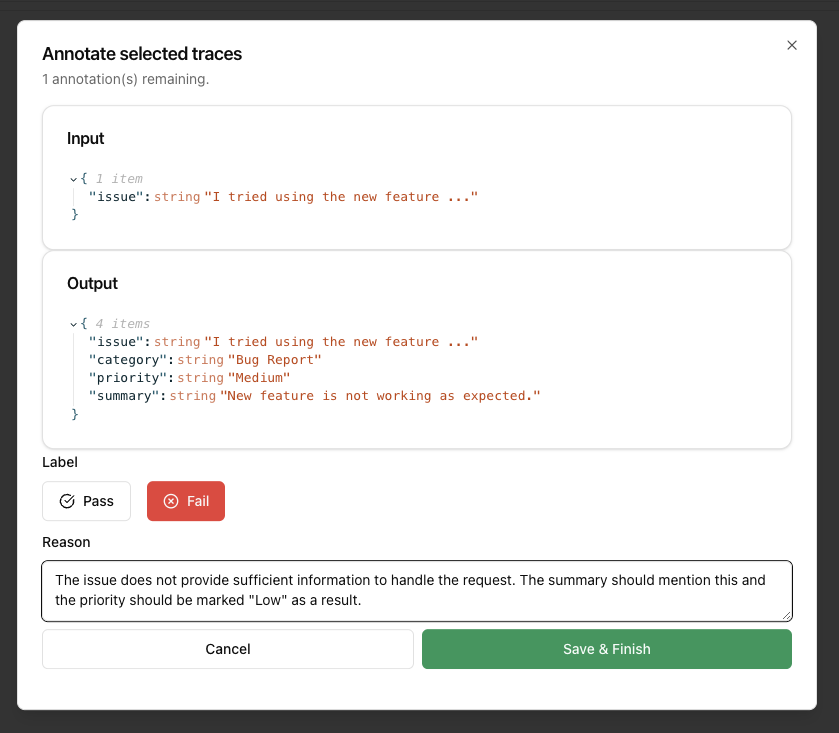
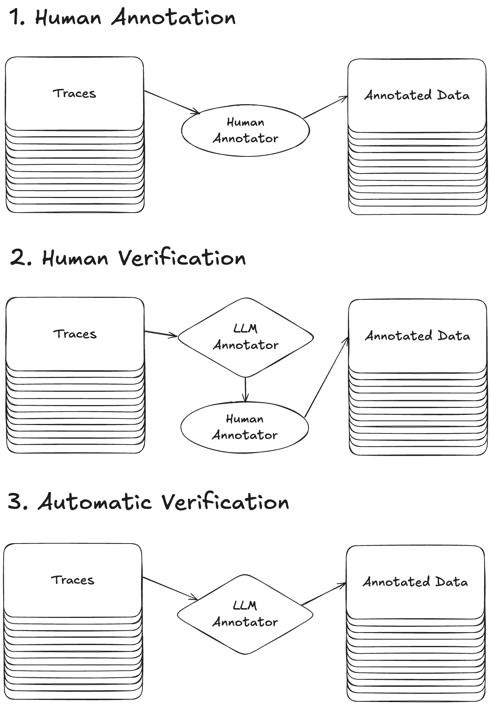

import { Table } from 'nextra/components'
import { Tabs } from "nextra/components";

# Introduction To Effective Prompt Engineering

> Four key principles for building effectively with Large Language Model (LLM) APIs.

**Following Along**:

Install `uv` and create a new project:

<Tabs items={["macOS and Linux", "Windows"]}>
  <Tabs.Tab>
    ```bash
    curl -LsSf https://astral.sh/uv/install.sh | sh 
    uv init promptimal
    cd promptimal
    ```
  </Tabs.Tab>
  <Tabs.Tab>
    ```bash
    powershell -ExecutionPolicy ByPass -c "irm https://astral.sh/uv/install.ps1 | iex" 
    uv init promptimal
    cd promptimal
    ```
  </Tabs.Tab>
</Tabs>

Install the necessary packages:

```bash
uv add "python-lilypad[openai]"
```

We will be using OpenAI, but you can specify other providers if you prefer (e.g. `anthropic` or `gemini`).

## 1. Understanding LLM API fundamentals

- The LLM API call is the fundamental building block
    - Everything builds on top of this primitive
    - All frameworks and tools ultimately make these calls
- Engineers must understand their building blocks
    - Can’t build effectively without know how pieces work
    - Debugging requires understand these basics
- How we structure our code is extremely important
    - Need to handle non-deterministic outputs
    - Proper preparation for evaluation is critical

### LLM Calls Are Functions

In it's simplest form, an LLM API call might look like this:

```python
from mirascope import llm


@llm.call(provider="openai", model="gpt-4o-mini")
def answer_question(question: str) -> str:
    return f"Answer this question: {question}"


response = answer_question("What is the capital of France?")
print(response.content)
# > The capital of France is Paris.
```

Here, `answer_question` takes the input argument `question` and returns a response generated by OpenAI's `gpt-4o-mini`. The `llm.call` decorator is a simple wrapper that converts the function into an API call to the specified LLM provider.

It's important to understand the underlying API, so let's dig deeper using OpenAI's official SDK.

### Prompts

When using a product like ChatGPT, it can feel like the “prompt” is just the message you send to the model.

```python
question = "What is the capital of France?"
messages = [
    {"role": "user", "content": f"Answer this question: {quesetion}"},
]
```

Here, we have a single message with the `user` role. There are generally four main message roles:

- `system`: Messages that provide context or instructions to the model.
- `user`: Messages that represent the user input.
- `assistant`: Messages that represent the model's output.
- `tool`: Messages that represent the output of a tool (e.g. web search, weather API, etc.).

> OpenAI recently released the `developer` role that replaces the `system` role.

Since every call to the LLM's API is stateless, the list of messages is the only context the LLM will have access to when generating it's output. This means that multi-turn chats require maintaining the history of messages and sending it every time.

#### Prompt Templates

A common convention is to implement prompts as functions that take template variables in as the function's arguments and return the list of messages to send to the LLM.

For example, you might write a `chatbot_prompt` like this:

```python {5-6,10-11}
from openai.types.chat import ChatCompletionMessageParam


def chatbot_prompt(
    user_message: str,
    history: list[ChatCompletionMessageParam],
) -> list[ChatCompletionMessageParam]:
    return [
        {"role": "system", "content": "You are a helpful assistant."},
        *history,
        {"role": "user", "content": user_message},
    ]
```

Here, we are templating in the conversation history and the user's current message.

### Calling The LLM

Once we have our array of messages, we can make a call to the LLM API and return it's response:

```python {7-11}
from openai import OpenAI

client = OpenAI()


def answer_question(question: str) -> str:
    user_message = f"Answer this question: {question}"
    messages = chatbot_prompt(user_message, [])
    completion = client.chat.completions.create(
        model="gpt-4o-mini",
        messages=messages,
    )
    return str(completion.choices[0].message.content)


response = answer_question("What is the capital of France?")
print(response)
# > The capital of France is Paris.
```

#### Call Parameters

Call parameters are the additional settings you can provide to the LLM API call to further control how it responds. For example, you might set the `temperature` to control the randomness of the response.

```python {6}
def answer_question(question: str) -> str:
    user_message = f"Answer this question: {question}"
    messages = chatbot_prompt(user_message, [])
    completion = client.chat.completions.create(
        model="gpt-4o-mini",
        messages=messages,
        temperature=0.1,
    )
    return str(completion.choices[0].message.content)
```

Many LLM providers offer similar call parameters, but many also offer ones that are specific to their models. It's important to be able to use provider-specific features as necessary for your use-case.

### Structured Outputs (Response Models)

In the previous example, the final generated output is simply the `str` text generated by the LLM. However, in more complex systems, you might want to use the generated output downstream in ways where a `str` output falls short.

For example, you might want to first triage an issue into a structured `Ticket` format so that you can then decide the correct next step for the issue:

```python {4,9-12,21,32-34}
from typing import Literal

from openai import OpenAI
from pydantic import BaseModel

client = OpenAI()


class Ticket(BaseModel):
    category: Literal["bug", "feature request"]
    priority: Literal["low", "medium", "high"]
    summary: str


def triage_issue(issue: str) -> Ticket | None:
    user_message = f"Please triage this issue: {issue}"
    messages = chatbot_prompt(user_message, [])
    completion = client.beta.chat.completions.parse(
        model="gpt-4o-mini",
        messages=messages,
        response_format=Ticket,
    )
    return completion.choices[0].message.parsed


issue = """
I tried using the new feature but it's not working as expected.
Can you help me figure out what's going wrong?
"""
ticket = triage_issue(issue)
print(ticket)
# > category='bug'
#   priority='high'
#   summary='New feature not working as expected'
```

Under the hood, the `Ticket` class is dumped as a JSON schema, the LLM generates JSON matching that schema, and the generated output is then validated against the schema using Pydantic.

### Tools (Agents)

Tools are really just functions that you tell the LLM it can request be called. *This is important*. The LLM does not actually call the tool -- it asks you to call it on its behalf.

For example, you might have a tool that would let the LLM ask a manager for assistance:

```python
def ask_manager(question: str) -> str:
    """Returns the managers answer to the question."""
    print(f"[NEED ASSISTANCE]: {question}")
    return input("[ANSWER]: ")
```

First, you need to define a schema that represents the function signature of the tool:

```python
from openai.types.chat import ChatCompletionToolParam


tools: list[ChatCompletionToolParam] = [{
    "function": {
        "name": "ask_manager",
        "description": "Returns the managers answer to the question.",
        "parameters": {
            "properties": {"question": {"type": "string"}},
            "required": ["question"],
            "type": "object",
        },
    },
    "type": "function",
}]
```

Next, you need to map each tool's name to it's function definition so you can later call it for the LLM:

```python
from collections.abc import Callable


names_to_tools: dict[str, Callable[..., str]] = {"ask_manager": ask_manager}
```

Last, you provide the tool schemas to the LLM alongside your messages. If the LLM responds with tool calls, you simply call them on it's behalf and call the LLM again with the results as message parameters with the role `tool` until the LLM is done calling tools.

```python {20,31-39,44-46}
import json

from openai import OpenAI
from openai.types.chat import ChatCompletionMessageParam, ChatCompletionMessageToolCall

client = OpenAI()


def chatbot_llm_call(
    user_message: str | None, history: list[ChatCompletionMessageParam]
) -> list[ChatCompletionMessageToolCall] | str:
    if user_message:
        messages = chatbot_prompt(user_message, history)
        history.append(messages[-1])
    else:
        messages = history
    completion = client.chat.completions.create(
        model="gpt-4o-mini",
        messages=messages,
        tools=tools,
    )
    history.append(completion.choices[0].message)  # pyright: ignore [reportArgumentType]
    if tool_calls := completion.choices[0].message.tool_calls:
        return tool_calls
    return str(completion.choices[0].message.content)


def chatbot(user_message: str) -> str:
    history: list[ChatCompletionMessageParam] = []
    response = chatbot_llm_call(user_message, history)
    while not isinstance(response, str):
        for tool_call in response:
            tool = names_to_tools[tool_call.function.name]
            output = tool(**json.loads(tool_call.function.arguments))
            history.append(
                {"role": "tool", "content": output, "tool_call_id": tool_call.id}
            )
            response = chatbot_llm_call(user_message, history)
    return response


response = chatbot("What is the plan?")
print(response)
# > [NEED ASSISTANCE]: What is the plan?
# > [ANSWER]: There is no plan
# > There is no plan
```

Calling tools in a loop like this until the LLM is done calling tools is a common pattern when working with LLMs. It is the simplest form of what most would call an "LLM agent".

## 2. How Do We Test LLM Functions?

As software developers, we are used to building systems that are deterministic. We write unit tests to ensure that our code behaves as expected, and we can rely on those tests to catch regressions.

LLM APIs are magical because they have made it possible to integrate AI into our applications with just a few lines of code.

However, **functions powered by LLMs are non-deterministic**. This means that traditional unit tests are insufficient for ensuring that our code behaves as desired.

### Prompt Engineering == Optimization Process

> *If you're expecting 100% reliability, stop expecting that.*



Since LLM functions have non-deterministic outcomes, we need to continuously iterate, evaluate, and optimize the functions to ensure they are consistently generating high quality outputs.

By structuring LLM API calls as functions, we've nicely wrapped up all of the non-determinisim into a single unit, which we'll call a Generation.

### Generations

Generations are functions that take some set of inputs (i.e. the function's arguments) and return a final, generated output (i.e. the function's return value). They are the core building block when working with LLM APIs.



In order to optimize our generations, we need to keep track of all of our example data, versions, and evaluations. This is where Lilypad comes in.

### Automatic Tracing

The first step is to ensure that we are properly tracing every call to the LLM and collecting example data.

With Lilypad, you can easily trace all of your LLM API calls with a few lines of code:

```python {3,6-7,9}
import os

import lilypad
from openai import OpenAI

os.environ["LILYPAD_PROJECT_ID"] = "YOUR_PROJECT_ID"
os.environ["LILYPAD_API_KEY"] = "YOUR_API_KEY"

lilypad.configure()

client = OpenAI()


def answer_question(question: str) -> str:
    completion = client.chat.completions.create(
        model="gpt-4o-mini",
        messages=[{"role": "user", "content": f"Answer this question: {question}"}],
    )
    return str(completion.choices[0].message.content)


response = answer_question("What is the capital of France?")
print(response)
# > The capital of France is Paris.
```

This will capture all of the input/output data of the LLM API call to OpenAI (as well as a few additional computed fields such as cost):



While this is a necessary first step, **it's not sufficient**.

### Automatic Verisoning

By the time we are tracing the call to the LLM API, we've lost the structure of our generation, which makes comparing different versions of generations difficult (or impossible in some cases).

With Lilypad, simply marking your generations with the `generation` decorator will automatically version and trace your generations:

```python {14}
import os

import lilypad
from openai import OpenAI

os.environ["LILYPAD_PROJECT_ID"] = "YOUR_PROJECT_ID"
os.environ["LILYPAD_API_KEY"] = "YOUR_API_KEY"

lilypad.configure()

client = OpenAI()


@lilypad.generation()
def answer_question(question: str) -> str:
    completion = client.chat.completions.create(
        model="gpt-4o-mini",
        messages=[{"role": "user", "content": f"Answer this question: {question}"}],
    )
    return str(completion.choices[0].message.content)


response = answer_question("What is the capital of France?")
print(response)
# > The capital of France is Paris.
```



Any change made to the generation function will be automatically detected and versioned. This makes it possible to build and run generations without having to worry about what version produced what output on what input.

For example, we could refactor our messages array into a prompt template function, and the `generation` decorator will still capture any changes to the prompt automatically:

```python {14-17,24}
import os

import lilypad
from openai import OpenAI

os.environ["LILYPAD_PROJECT_ID"] = "YOUR_PROJECT_ID"
os.environ["LILYPAD_API_KEY"] = "YOUR_API_KEY"

lilypad.configure()

client = OpenAI()


def answer_question_prompt(question: str) -> list[ChatCompletionMessageParam]:
    return [
        {"role": "user", "content": f"Answer this question: {question}"},
    ]


@lilypad.generation()
def answer_question(question: str) -> str:
    completion = client.chat.completions.create(
        model="gpt-4o-mini",
        messages=answer_question_prompt(question),
    )
    return str(completion.choices[0].message.content)


response = answer_question("What is the capital of France?")
print(response)
# > The capital of France is Paris.
```



*This is important*. We not have an exact snapshot of each generation version, which means that we can always recreate a specific version of a generation (e.g. rollback, compare, etc.).

The corollary is that we should include everything we consider a part of a generation's version as part of the code and everything else as input argument values. 

## 3. How Do We Evaluate Generated Outputs?

A key step to our optimization process is evaluating outputs. But how do we evaluate non-deterministic outputs?

### Look At Your Data

The first step in evaluation is to actually look at your generation data. Not just a few cherry-picked examples, but a representative sample of real outputs.

Key things to examine:

- Common modes of failure
- Unexpected or inconsistent outputs
- Response quality and relevance

Lilypad makes this easy by automatically capturing all your generation runs. You can filter and analyze runs to identify patterns and potential improvements.



### Metrics Are Necessary, So Annotate While You Look

Without some measure of quality, it's impossible to know if your generations are improving or not. As you review generations, it's important to consistently annotate the traces and collect them into a dataset which against you can test your generation versions.

For tasks that have a clear "correct" output, binary correct/incorrect annotations can be a good starting point. However, many tasks involving LLMs are more nuanced and require fuzzier evaluation criteria.

We recommend using an annotation system with PASS/FAIL labels and a reasoning for the label. This will allow you to track the reasons for failures and successes and use that information to improve your generations beyond just the binary label.



### Automating Annotations

While manual annotation is crucial, it doesn't scale. A representative dataset can contain hundreds or thousands of examples, and manually annotating each one is time-consuming and error-prone. In most cases, you simply won't annotate the data for each new generation version, which defeats the purpose.

Instead, you should work to automate your evaluation process as much as possible. This can be done by:

- Collecting annotated examples with correct labels and reasoning
- Engineering an LLM judge to evaluate the generation
- Verify the judge's accuracy with a human-in-the-loop
- Iterate on the judge until you have a high level of confidence in its accuracy



This loop moves the majority of the work from "labeling" to "verification", which makese the task far more manageable. We can also automatically determine the PASS/FAIL label for the LLM judge's generated annotation by analyzing when the generated label is changed during verification. We can also synthesize the reasoning by comparing the generated reasoning with the updated human annotator's reasoning.

If all goes well, you'll eventually have a judge you can trust to evaluate your generations automatically. However, even in such a case it's worth continuing to manually verify certain examples (e.g. those with high entropy).

We're working on some cool tooling here with Lilypad. If you're intersted in testing it out, let us know!

### "Good Enough" Is Good Enough

While PASS/FAIL labels + reasoning seem simple, they are in fact quite powerful. They define the fuzzy metric for "good enough".


It may seem tempting to introduce more granular scoring (e.g. 1-5), but this introduces unnecessary complexity. In practice we often find that LLM judges are significantly better as producing PASS/FAIL labels that match the human evaluator than granular scores.

This is likely in part due to the fact that it's unclear what a "3" vs. a "4" really means and where we draw the line on what we consider "good enough" for the generation.

Instead, we simply label generations with PASS/FAIL indicating whether the generation is "good enough" for our purposes or not. This is a much more clear and actionable metric. If a generation is failing, simply further engineer the prompt until it's consistently passing.

At the end of the day, the most important part of the evaluation process is bootstrapping it with a human evaluator with enough domain expertise to properly annotate and kickstart the system.

The "good enough" metric is flexible enough to capture the nuances of what makes a generation high enough quality -- to be "good enough" to put in the hands of your users.

## 4. Choosing The Right Level Of Abstraction

When building with LLMs, the abstractions you choose fundamentally shape your ability to build robust and maintainable systems. Let's explore the key principles that should guide your choice of tools and libraries.

### Core Principles

#### Control

At the very least, we must be able to structure our code around generations. If there are generations happening under the hood, we need to be able to access those for versioning and evaluation.

We've implemented our own library, Mirascope, around the concept of generations. Here's an example of a simple LLM call:

```python copy
from mirascope import llm


@llm.call(provider="openai", model="gpt-4o-mini")
def answer_question(question: str) -> str:
    return f"Answer this question: {question}"


response = answer_question("What is the capital of France?")
print(response.content)
# > The capital of France is Paris.
```

The `llm.call` decorator turns the function into an LLM API call. Each of these calls is a generation that can be versioned and traced using Lilypad.

#### Simplicity

It's important that the abstractions we choose are simple and easy to understand. The more complex the abstraction, the more difficult it is to debug and maintain.

Ideally, the code you write should be extremely readable and easily understood. Furthermore, reducing the number of changes necessary for updating the functionality of the generation makes it easier to compare different generation versions.

For example, Mirascope enables writing tools directly as functions, which makes it easy to understand, extend, and compare the tool's functionality as it evolves:

<Tabs items={["Version 1", "Version 2"]}>
  <Tabs.Tab title="Mirascope">
    ```python copy


    @llm.call(
        provider="openai",
        model="gpt-4o-mini",

    )
    def answer_question(question: str) -> str:
        return f"Answer this question: {question}"


    response = answer_question("What is the plan?")
    print(response.content)
    ```
    </Tabs.Tab>
    <Tabs.Tab title="Version 2">
    ```python {1-4,10} copy 
    def request_assistance(question: str) -> str:
        """Returns the managers answer to the question."""
        print(f"[NEED ASSISTANCE]: {question}")
        return input("[ANSWER]: ")


    @llm.call(
        provider="openai",
        model="gpt-4o-mini",
        tools=[request_assistance],
    )
    def answer_question(question: str) -> str:
        return f"Answer this question: {question}"


    response = answer_question("What is the plan?")
    if tools := response.tools:
        for tool in tools:
            output = tool.call()
            print(f"[TOOL]: {output}")
    ```
    </Tabs.Tab>
</Tabs>

#### Extensibility

No library can anticipate all possible use cases. Your tools should make it straightforward to extend functionality when needed, rather than forcing you to work around their limitations. This means favoring libraries that expose clear extension points and don't hide core functionality behind opaque abstractions.

With Mirascope, for example, we've implemented a `middleware_factory` method that makes it easy to implement your own custom middleware.

```python {4}
from mirascope import llm


@with_saving()  # this custom middleware saves e.g. cost info in a database
@llm.call(provider="openai", model="gpt-4o-mini")
def answer_question(question: str) -> str:
    return f"Answer this question: {question}"


response = answer_question("What is the capital of France?")
print(response.content)
# > The capital of France is Paris.
```

This middleware provides full access to all information you may want to e.g. log so you aren't tied in to any one logging tool.

#### Portability

The most important lever for optimizating your generations is the LLM that powers them. It's important that you can easily test out the same prompt (or different prompts) across various providers to see which model performs the best for your task.

Mirascope provides a standardized interface that works across all support providers:

<Tabs items={["OpenAI", "Anthropic", "Gemini"]}>
  <Tabs.Tab>
    ```python {5-6}
    from mirascope import llm


    @llm.call(
        provider="openai",
        model="gpt-4o-mini",
    )
    def answer_question(question: str) -> str:
        return f"Answer this question: {question}"


    response = answer_question("What is the capital of France?")
    print(response.content)
    # > The capital of France is Paris.
    ```
  </Tabs.Tab>
  <Tabs.Tab>
    ```python {5-6}
    from mirascope import llm


    @llm.call(
        provider="anthropic",
        model="claude-3-5-sonnet-latest",
    )
    def answer_question(question: str) -> str:
        return f"Answer this question: {question}"


    response = answer_question("What is the capital of France?")
    print(response.content)
    # > The capital of France is Paris.
    ```
  </Tabs.Tab>
  <Tabs.Tab>
    ```python {5-6}
    from mirascope import llm


    @llm.call(
        provider="gemini",
        model="gemini-2.0-flash",
    )
    def answer_question(question: str) -> str:
        return f"Answer this question: {question}"


    response = answer_question("What is the capital of France?")
    print(response.content)
    # > The capital of France is Paris.
    ```
  </Tabs.Tab>
</Tabs>

You can also easily override a given call to use a different provider, model, or call params:

```python {12-17}
from mirascope import llm


@llm.call(
    provider="openai",
    model="gpt-4o-mini",
)
def answer_question(question: str) -> str:
    return f"Answer this question: {question}"


response = llm.override(
    answer_question,
    provider="anthropic",
    model="claude-3-5-sonnet-latest",
    call_params={"temperature": 0.7},
)("What is the capital of France?")
print(response.content)
# > The capital of France is Paris.
```

### Our Recommendation

Use what you're most comfortable with!

We've built Lilypad to handle code, not libraries or frameworks. It's a tool for structuring things around generations. How you implement your generations is up to you.

## Thank You!

If you have any questions or are interested in learning more about Mirascope or Lilypad:

- Join our Slack community [here](https://join.slack.com/t/mirascope-community/shared_invite/zt-2ilqhvmki-FB6LWluInUCkkjYD3oSjNA).
- Check out the [Mirascope Docs](https://mirascope.com/WELCOME)
- Check out the [Lilypad Docs](https://lilypad.so/docs)