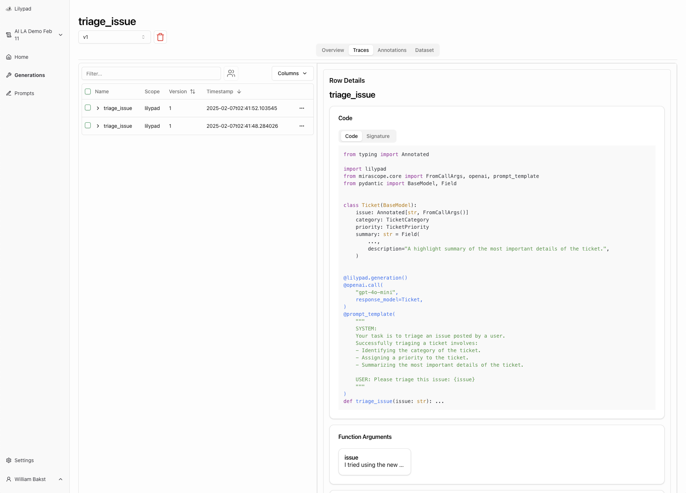

import { Table } from 'nextra/components'

# Building With LLMs

Four key principles to build effectively with Large Language Model (LLM) APIs

## 0. Following Along

URL: https://workshops.lilypad.so/ai-la-salon-feb-11

We'll be using OpenAI, Mirascope, and Lilypad for this workshop.

Complete the [Lilypad Quickstart Guide](https://lilypad.so/docs/quickstart) first if you would like to follow along, which will ensure you have a Lilypad account as well as all the necessary packages installed.

## 1. Choosing The Right Level Of Abstraction

When building with LLMs, the abstractions you choose fundamentally shape your ability to build robust and maintainable systems. Let's explore the key principles that should guide your choice of tools and libraries.

### Core Principles

#### Simplicity
The best abstractions introduce new concepts only when they provide clear value. Each new concept or pattern a library introduces creates cognitive overhead and potential points of failure. Good abstractions should simplify common patterns while avoiding unnecessary complexity.

#### Control
As LLM capabilities rapidly evolve, maintaining direct control over your interactions with them is essential. This means having the ability to modify prompts, adjust parameters, and fine-tune the behavior of your system. Libraries that abstract away these controls can limit your ability to leverage new features or optimize for your specific use case.

#### Extensibility
No library can anticipate all possible use cases. Your tools should make it straightforward to extend functionality when needed, rather than forcing you to work around their limitations. This means favoring libraries that expose clear extension points and don't hide core functionality behind opaque abstractions.

#### Portability
Ideally your code is not too tightly coupled to specific LLM providers or implementations. The ability to swap between different models or providers gives you flexibility as the landscape evolves and more intelligent models are released. This requires abstractions that focus on the essential patterns of LLM interaction rather than provider-specific features.

#### Transparency
Your code should be clear about what it's doing at each step. When working with LLMs, understanding exactly how your inputs are being processed and transformed is crucial for debugging, optimization, and maintenance. Hidden transformations or "magic" can lead to unexpected behaviors that are difficult to diagnose and fix.

### Making The Right Choice

When evaluating tools and libraries, ask yourself:

- Can I directly access and modify the prompts?
- Do I understand how my inputs are being transformed?
- Can I easily swap out different LLM providers?
- Will this abstraction still make sense as LLM capabilities evolve?
- Is it easy to extend functionality myself as necessary?
- Does it have good documentation?
- Is it actively maintained?
- Does it feel lean or bloated? Readable or clunky?

We've implemented our own library, Mirascope, in line with these principles. Here's an example of a simple LLM call:

```python copy
from mirascope import llm


@llm.call(provider="openai", model="gpt-4o-mini")
def answer_question(question: str) -> str:
    return f"Answer this question: {question}"


response = answer_question("What is the capital of France?")
print(response.content)
# > The capital of France is Paris.
```

## 2. Understanding LLM API fundamentals

- The LLM API call is the fundamental building block
    - Everything builds on top of this primitive
    - All frameworks and tools ultimately make these calls
- Engineers must understand their building blocks
    - Can’t build effectively without know how pieces work
    - Debugging requires understand these basics
- How we structure our code is extremely important
    - Need a solid foundation to build robust systems

### What Is The "Prompt"?

When using a product like ChatGPT, it can feel like the "prompt" is just the message you send to the model.

However, the prompt is actually a list of messages each with a defined role.

Generally there are four message roles:
- `system`: Messages that provide context or instructions to the model.
- `user`: Messages that represent the user input.
- `assistant`: Messages that represent the model's output.
- `tool`: Messages that represent the output of a tool.

For example, if you message ChatGPT again after a response, the "prompt" sent to the model will include not only the new message but also all of the previous messages in the conversation.

Mirascope provides a `prompt_template` decorator that enables writing prompts as functions, which we find a more readable format. The function then takes care of converting the provided template into message parameters.

```python copy {6-13,25-34}
from mirascope.core import prompt_template


@prompt_template(
    """
    SYSTEM:
    Your task is to triage an issue posted by a user.
    Successfully triaging a ticket involves:
    - Identifying the category of the ticket.
    - Assigning a priority to the ticket.
    - Summarizing the most important details of the ticket.

    USER: Please triage this issue: {issue}
    """
)
def triage_issue_prompt(issue: str): ...


issue = """
I tried using the new feature but it's not working as expected.
Can you help me figure out what's going wrong?
""".strip()
messages = triage_issue_prompt(issue)
print(messages)
# [
#     BaseMessageParam(
#         role="system",
#         content="Your task is to triage an issue posted by a user.\nSuccessfully triaging a ticket involves:\n- Identifying the category of the ticket.\n- Assigning a priority to the ticket.\n- Summarizing the most important details of the ticket.",
#     ),
#     BaseMessageParam(
#         role="user",
#         content="Please triage this issue: I tried using the new feature but it's not working as expected.\nCan you help me figure out what's going wrong?",
#     ),
# ]
```

The prompt is ultimately the most important part of the API call, so it's crucial to maintain full control over it.

### Generations

Once you have a prompt, you can send it to the model to generate a response, which we call a "generation".

Mirascope makes this super easy -- just add a `call` decorator to your function:

```python copy {4,24-30}
from mirascope.core import openai, prompt_template


@openai.call("gpt-4o-mini")
@prompt_template(
    """
    SYSTEM:
    Your task is to triage an issue posted by a user.
    Successfully triaging a ticket involves:
    - Identifying the category of the ticket.
    - Assigning a priority to the ticket.
    - Summarizing the most important details of the ticket.
 
    USER: Please triage this issue: {issue}
    """
)
def triage_issue(issue: str): ...


issue = """
I tried using the new feature but it's not working as expected.
Can you help me figure out what's going wrong?
""".strip()
response = triage_issue(issue)
print(response.content)
# > **Category:** Feature Bug
#
#   **Priority:** Medium
#
#   **Summary:** The user reports that a new feature is not functioning as expected. They are seeking assistance to identify and resolve the issue. Further investigation may be needed to understand the specific problems encountered with the feature.
```

It's important to structure your generations such that anything that could impact the final generated output should happen within the generation function.

We'll cover this in more detail in the section on "Prompt Engineering".

### Structured Outputs

In the previous example, the final generated output is simply the `str` text generated by the LLM.

If you're directly returning this response to a user, that might be all you need. However, it's common when building more complex systems to want to use the generated output downstream.

For example, you might want to first triage an issue into a structured `Ticket` format so that you can then decide the correct next step for the issue.

```python copy {9-11,14-18,21-28,33,54-59}
import inspect
from enum import Enum
from typing import Annotated

from mirascope.core import FromCallArgs, openai, prompt_template
from pydantic import BaseModel, Field


class TicketCategory(str, Enum):
    BUG_REPORT = "Bug Report"
    FEATURE_REQUEST = "Feature Request"


class TicketPriority(str, Enum):
    LOW = "Low"
    MEDIUM = "Medium"
    HIGH = "High"
    URGENT = "Urgent"


class Ticket(BaseModel):
    issue: Annotated[str, FromCallArgs()]
    category: TicketCategory
    priority: TicketPriority
    summary: str = Field(
        ...,
        description="A highlight summary of the most important details of the ticket.",
    )


@openai.call(
    "gpt-4o-mini",
    response_model=Ticket,
)
@prompt_template(
    """
    SYSTEM:
    Your task is to triage an issue posted by a user.
    Successfully triaging a ticket involves:
    - Identifying the category of the ticket.
    - Assigning a priority to the ticket.
    - Summarizing the most important details of the ticket.

    USER: Please triage this issue: {issue}
    """
)
def triage_issue(issue: str): ...


issue = inspect.cleandoc("""
I tried using the new feature but it's not working as expected.
Can you help me figure out what's going wrong?
""")
ticket = triage_issue(issue)
print(ticket)
# > issue="I tried using the new feature but it's not working as expected.\nCan you help me figure out what's going wrong?"
#   category=<TicketCategory.BUG_REPORT: 'Bug Report'>
#   priority=<TicketPriority.MEDIUM: 'Medium'>
#   summary='User is experiencing issues with a new feature not functioning correctly.'
```

By using a structured output format, you can easily pass the output of one generation to the next step in your pipeline. You may want to implement separate generations for handling each issue category.

### Simple Agent (Tools)

When you give LLMs access to tools, you enable the LLM to decide if and when to use those tools. This can be a powerful way to extend the capabilities of your system.

However, this introduces additional complexity since the full sequence of steps is not strictly defined. We recommend starting with the simplest option first, only adding additional compleixity as necessary.

With Mirascope, we can easily call any tools requested by the LLM, returning the tool's outputs until the LLM is done calling tools, at which point the LLM returns it's final response.

```python {1-7,12,25-27,29,42-55}
def request_assistance(question: str) -> str:
    """Requests assistance from an expert.

    Ensure `question` is as clear and concise as possible.
    This will help the expert provide a more accurate response.
    """
    return input(f"[NEED ASSISTANCE] {question}\n[ANSWER] ")


@openai.call(
    "gpt-4o-mini",
    tools=[request_assistance],
)
@prompt_template(
    """
    SYSTEM:
    You are a customer support agent.
    Successfully responding to a ticket involves:
    - Understanding the issue.
    - Ensuring you have all the necessary information, asking if necessary.
    - Providing a helpful response that addresses the issue.

    You final response will be sent verbatim to the user.

    If unable to answer, request assistance from an expert.
    You can do so by calling the `request_assistance` tool.
    This tool is extremely helpful when you are lacking information or knowledge.

    MESSAGES: {history}
    USER: {ticket}
    """
)
def customer_support_bot(ticket: Ticket, history: list[openai.OpenAIMessageParam]): ...


issue = inspect.cleandoc("""
I tried using the new feature but it's not working as expected.
Can you help me figure out what's going wrong?
""")
ticket = triage_issue(issue)
history = []
response = customer_support_bot(ticket, history)
history += [response.user_message_param, response.message_param]
while tools := response.tools:
    history += response.tool_message_params([(tool, tool.call()) for tool in tools])
    response = customer_support_bot(ticket, history)
    history.append(response.message_param)
print(response.content)
# To assist you better, could you please provide more details about the new feature you are trying to use? Specifically, it would be helpful to know:
#
# 1. What is the name of the feature?
# 2. What specific issues are you encountering (e.g., error messages, functionality not responding)?
# 3. What steps did you take to use the feature?
#
# With this information, I can help identify the issue more accurately.
```

For the above example issue, the LLM (rightly) asks for more information without requesting for assistance.

We can update the issue to include e.g. "involve your manager" to likely trigger the `request_assistance` tool.

## 3. Prompt Engineering == Optimization Process

Up to this point, we've only discussed the "software" side of developing with LLMs.

**But LLMs are non-deterministic**.

This means that the same prompt can generate different outputs each time you call the model. This also means that changes in prompt template arguments can have a significant impact on the generated output.

In order to engineer prompts effectively, you must treat prompt engineering as an optimization process.

### Generations Are ML Models

It can help to think of each generation as it's own Machine Learning (ML) model.

<Table>
  <thead>
    <Table.Tr>
      <Table.Th>ML Model</Table.Th>
      <Table.Th>Generation</Table.Th>
    </Table.Tr>
  </thead>
  <tbody>
    <Table.Tr>
      <Table.Td>Model Weights</Table.Td>
      <Table.Td>Prompt Template</Table.Td>
    </Table.Tr>
    <Table.Tr>
      <Table.Td>Features</Table.Td>
      <Table.Td>Template Variables</Table.Td>
    </Table.Tr>
    <Table.Tr>
      <Table.Td>Hyperparameters</Table.Td>
      <Table.Td>Call Parameters (e.g temperature)</Table.Td>
    </Table.Tr>
    <Table.Tr>
      <Table.Td>Fine-Tuning</Table.Td>
      <Table.Td>Few-Shot Examples</Table.Td>
    </Table.Tr>
  </tbody>
</Table>

Framing prompt engineering this way can help to illuminate the steps by which we should optimize our prompts.

If we think of the prompt template as the model's weights, then we can think of making changes to the prompt template the same as training the ML model on training data. This means we need data against which we can "train" our prompt through template updates.

If we think of the template's variables as the model's features, then we should ensure that we structure our generations such that they template information that impacts the generation's output but not it's version. For example, this could include information about a specific user that you would use to personalize the generation.

If we think of the call parameters as the model's hyperparameters, then we should run a sweep against various different settings for the same prompt and evaluate which one has the best results. Note that updates to the call parameters should be versioned alongside the generation.

If we think of few-shot examples as fine-tuning, then we should ensure we provide examples indending to have a fine-tuning effect. This is a key distinction. For example, we could provide few-shot examples based on the user, producing a form of on-the-fly fine-tuning of the model's weights for a specific user.

This provides a rough framework by which we can systematically evaluate and improve our prompts.

Digging a little deeper on our comparison, it's worth noting that the "model weights" now live in the code itself. This is a key distinction that interestingly results in traditional ML tooling not being well-suited to this task.

This is why we're building Lilypad.

### Automatic Verisoning & Tracing

At a bare minimum, **you must track properly version and trace all generations**. Optimization processes are data hungry. The better the data you have, the better you'll be able to engineer your prompts.

With Lilypad, you can easily version and trace all your generations:

```python copy {1,5,8}
import lilypad
from dotenv import load_dotenv

load_dotenv()
lilypad.configure()


@lilypad.generation()
@openai.call(
    "gpt-4o-mini",
    response_model=Ticket,
)
@prompt_template(
    """
    SYSTEM:
    Your task is to triage an issue posted by a user.
    Successfully triaging a ticket involves:
    - Identifying the category of the ticket.
    - Assigning a priority to the ticket.
    - Summarizing the most important details of the ticket.
 
    USER: Please triage this issue: {issue}
    """
)
def triage_issue(issue: str): ...


issue = inspect.cleandoc("""
I tried using the new feature but it's not working as expected.
Can you help me figure out what's going wrong?
""")
ticket = triage_issue(issue)
```

The `lilypad.generation` decorator will capture the runnable closure for the decorated function. This means that simply running your generation function will capture a snapshot of the exact version that was run. It will also captures the trace of the function's run, including all inputs and outputs and underlying calls to the LLM API.



You'll notice that it captured the full code for `triage_issue`, including the `Ticket` model and the `TicketCategory` and `TicketPriority` enums. This is a powerful feature of Lilypad that allows you to automatically capture any changes that may impact your generation.

If we take our comparison with ML models to heart, we should ensure that anything we consider a "weight" be contained inside the generation's function. Anything we consider a "feature" should be an input argument to the generation.

This structure is important so that we can properly test multiple versions of a generation against the same input to determine if our prompt engineering is actually improving our generations.

## 4. Evaluation And Iteration

Unlike traditional software engineering, unit tests are insufficient when working with LLMs because they are non-deterministic. In order to treat prompt engineering properly as an optimization process, we must consistently evaluate, iterate on, and improve our prompts.

### Look At Your Data

The first step in evaluation is to actually look at your generation data. Not just a few cherry-picked examples, but a representative sample of real outputs.

Key things to examine:

- Common modes of failure
- Unexpected or inconsistent outputs
- Response quality and relevance

Lilypad makes this easy by automatically capturing all your generation runs. You can filter and analyze runs to identify patterns and potential improvements.


### Metrics Are Necessary, So Annotate While You Look

Without some measure of quality, it's impossible to know if your generations are improving or not. As you review generations, it's important to consistently annotate the traces and collect them into a dataset which against you can test your generation versions.

For tasks that have a clear "correct" output, binary correct/incorrect annotations can be a good starting point. However, many tasks involving LLMs are more nuanced and require fuzzier evaluation criteria.

We recommend using an annotation system with PASS/FAIL labels and a reasoning for the label. This will allow you to track the reasons for failures and successes and use that information to improve your generations beyond just the binary label.


### Automating Annotations

While manual annotation is crucial, it doesn't scale. A representative dataset can contain hundreds or thousands of examples, and manually annotating each one is time-consuming and error-prone. In most cases, you simply won't annotate the data for each new generation version, which defeats the purpose.

Instead, you should work to automate your evaluation process as much as possible. This can be done by:

- Collecting annotated examples with correct labels and reasoning
- Engineering an LLM judge to evaluate the generation
- Verify the judge's accuracy with a human-in-the-loop
- Iterate on the judge until you have a high level of confidence in its accuracy

This loop moves the majority of the work from "labeling" to "verification", which makese the task far more manageable.

If all goes well, you'll eventually have a judge you can trust to evaluate your generations automatically. However, even in such a case it's worth continuing to manually verify certain examples (e.g. those with high entropy).

We're working on some cool tooling here with Lilypad. If you're intersted in testing it out, let us know!

### What "Good Enough" Really Means

While PASS/FAIL labels + reasoning seem simple, they are in fact quite powerful. They define the fuzzy metric for "good enough".

It may seem tempting to introduce more granular scoring (e.g. 1-5), but this introduces unnecessary complexity. In practice we often find that LLM judges are significantly better as producing PASS/FAIL labels that match the human evaluator than granular scores.

This is likely in part due to the fact that it's unclear what a "3" vs. a "4" really means and where we draw the line on what we consider "good enough" for the generation.

Instead, we simply label generations with PASS/FAIL indicating whether the generation is "good enough" for our purposes or not. This is a much more clear and actionable metric. If a generation is failing, simply further engineer the prompt until it's consistently passing.

At the end of the day, the most important part of the evaluation process is bootstrapping it with a human evaluator with enough domain expertise to properly annotate and kickstart the system.

## Thank You!

If you have any questions or are interested in learning more about Mirascope or Lilypad, join our Slack community [here](https://join.slack.com/t/mirascope-community/shared_invite/zt-2ilqhvmki-FB6LWluInUCkkjYD3oSjNA).